# Observabilite avec Prometheus, Grafana et Thanos

> Note : j'ai utilise Claude (Claude Code) comme assistant pour la mise en forme de ce README et pour structurer les commits du depot. Le travail technique (lancement des conteneurs, ecriture des configs, tests des requetes PromQL, captures d'ecran) a ete realise par mes soins.

> Le TP **Grafana Alloy & OpenTelemetry** (collecteur OTel vers Mimir, Loki et Tempo) est sur la branche [`labs-alloy`](https://github.com/Sipixer/prometheus-grafana-thanos-labs/tree/labs-alloy), avec son propre README.

## Module 1 - Prometheus

### Exercice 1 : Installer Prometheus et acceder a l'interface web

J'ai mis en place un docker-compose pour lancer Prometheus sur le port 9090 avec un volume persistant.

```bash
cd prometheus
docker compose up -d
```

J'ai ensuite ouvert http://localhost:9090 et verifie dans Status > Targets que Prometheus se scrape bien lui-meme (cible UP).

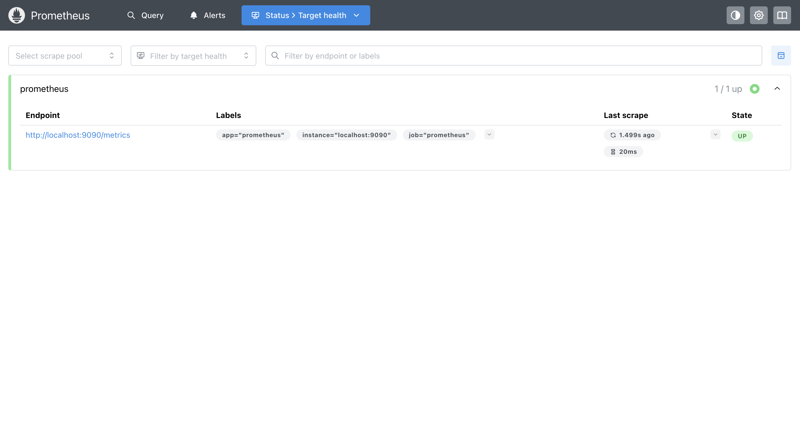

### Exercice 2 : Ecrire votre premier prometheus.yml

J'ai ecrit mon propre `prometheus.yml` avec un `scrape_interval` global de 10s et un external label `environment=lab`. J'ai ajoute le flag `--web.enable-lifecycle` au docker-compose pour pouvoir recharger la config a chaud.

Apres avoir relance le conteneur, j'ai verifie dans Status > Configuration que mes parametres etaient bien pris en compte.

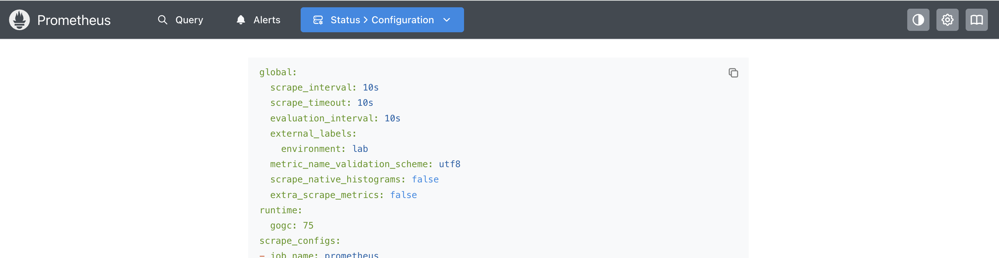

J'ai ensuite modifie une valeur dans le fichier (passage de `environment: lab` a `environment: staging`) et declenche un reload sans redemarrer le conteneur :

```bash
curl -X POST http://localhost:9090/-/reload
```

La nouvelle valeur apparait dans Status > Configuration.

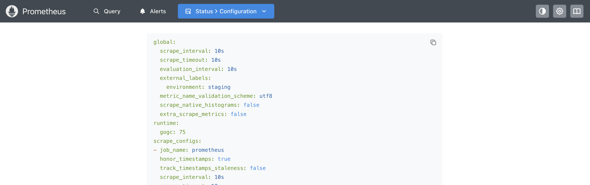

### Exercice 3 : Ajouter node_exporter et scraper les metriques systeme

J'ai ajoute le service `node-exporter` au docker-compose (port 9100) et un nouveau job `node` dans `prometheus.yml` qui pointe vers `node-exporter:9100` (DNS interne du reseau Compose).

Apres `docker compose up -d`, j'ai verifie dans Status > Targets que la cible `node` est UP.

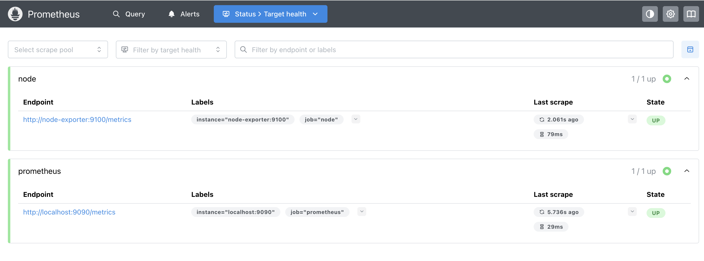

J'ai ensuite teste la metrique `node_cpu_seconds_total` dans l'expression browser pour confirmer que les metriques systeme remontent bien.

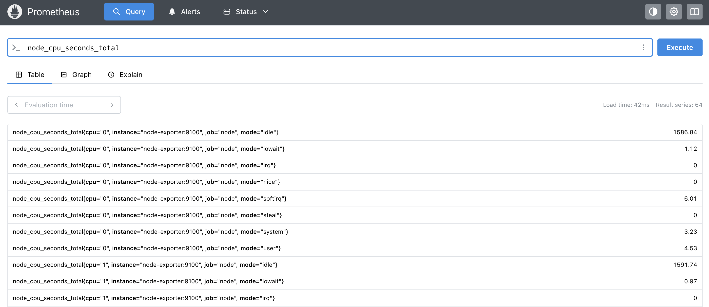

### Exercice 4 : Decouverte de service par fichier (file_sd)

J'ai remplace les `static_configs` par une decouverte dynamique via un fichier JSON. Le dossier `prometheus/sd/` est monte dans le conteneur sur `/etc/prometheus/sd`, et le job utilise `file_sd_configs` avec un `refresh_interval: 5s` pour voir les changements rapidement.

Au premier lancement, j'ai mis seulement `prometheus:9090` dans `targets.json` et verifie dans Status > Targets qu'une seule cible apparaissait.

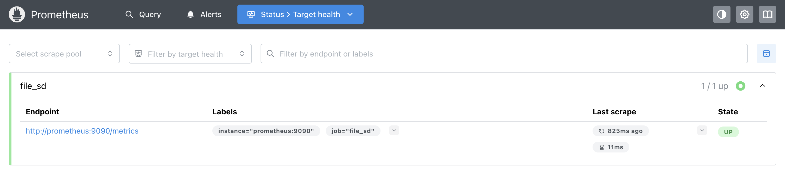

J'ai ensuite ajoute `node-exporter:9100` dans le JSON, sans recharger Prometheus. Apres quelques secondes, la nouvelle cible est apparue automatiquement dans Targets.

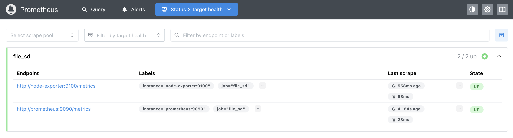

### Exercice 5 : Recording rules

J'ai ajoute une mini-app Flask `demo-api` qui expose les metriques `demo_http_*` (compteurs, histogramme de latence). Elle est buildee directement par le docker-compose.

J'ai cree un fichier `prometheus/rules/api_rules.yml` avec un groupe evalue toutes les 30s qui pre-calcule la metrique `job:http_requests:rate5m` (taux de requetes par job sur 5min). J'ai monte le dossier `rules/` dans le conteneur et ajoute `rule_files` dans `prometheus.yml`.

Apres reload de Prometheus, j'ai verifie dans Status > Rules que le groupe `api` est bien pris en compte avec sa frequence de 30s.

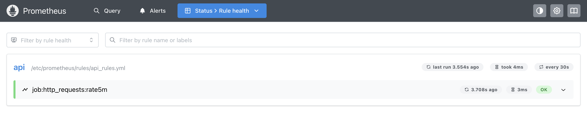

J'ai lance une boucle curl pour generer du trafic sur `/api/users` et `/api/orders`, puis interroge la nouvelle metrique `job:http_requests:rate5m` dans l'expression browser.

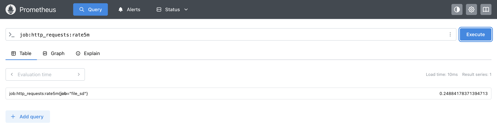

### Exercice 6 : Regles d'alerte et Alertmanager

J'ai ajoute un service `alertmanager` (port 9093) au docker-compose, avec une config minimale dans `prometheus/alertmanager/alertmanager.yml` (un receiver vide suffit pour le TP).

J'ai cree le fichier `prometheus/rules/api_alerts.yml` avec une alerte `HighErrorRate` qui se declenche si le ratio d'erreurs 5xx depasse 5% pendant 2 minutes. J'ai ensuite ajoute le bloc `alerting.alertmanagers` dans `prometheus.yml` pour pointer vers `alertmanager:9093`.

Avec la boucle curl active (demo-api genere ~5-8% d'erreurs naturelles), l'alerte passe en PENDING des que le seuil est franchi, puis en FIRING apres 2 minutes.

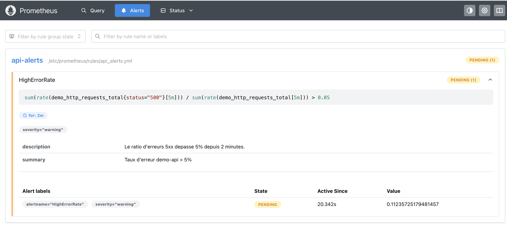

Une fois en FIRING, l'alerte est envoyee a Alertmanager et apparait dans son interface sur http://localhost:9093.

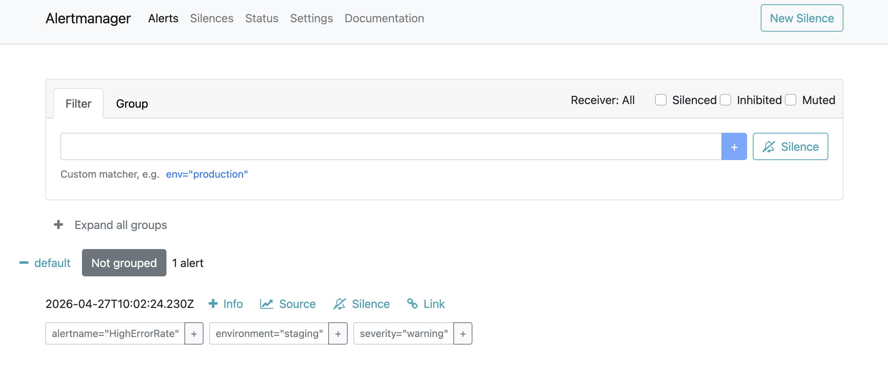

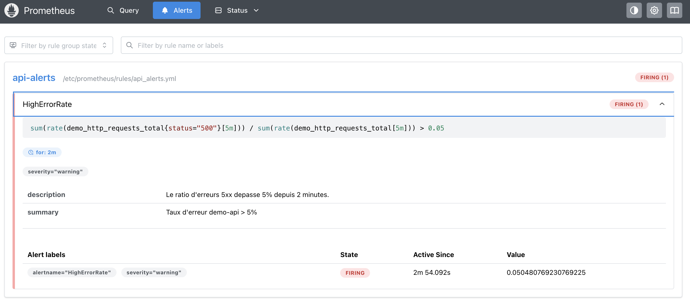

### Exercice 7 : PromQL - vecteurs instantanes, vecteurs de plage et scalaires

J'ai pratique les differents types de donnees PromQL dans l'expression browser, avec ma boucle curl active sur demo-api.

**1. `demo_http_requests_total`** — vecteur instantane : une valeur par serie au moment de l'evaluation, une ligne par combinaison `endpoint`/`status`.

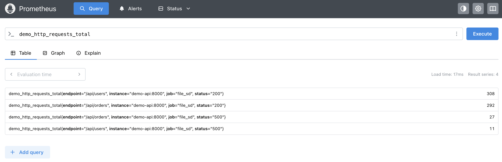

**2. `demo_http_requests_total[1m]`** — vecteur de plage : pour chaque serie, une tranche d'historique sur la derniere minute. Le mode Graph ne fonctionne pas, seul le Table affiche les echantillons avec leurs timestamps.

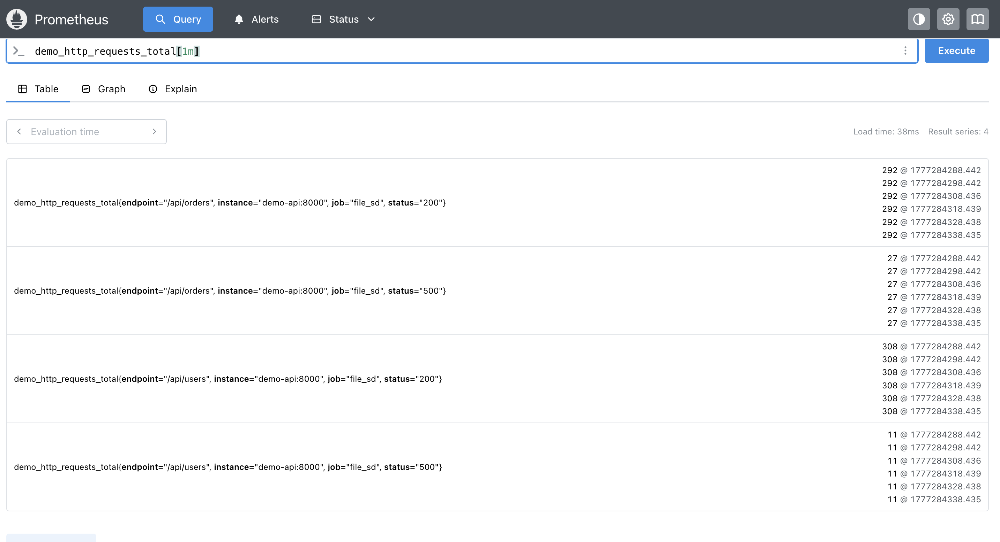

**3. `rate(demo_http_requests_total[1m])`** — `rate()` prend un vecteur de plage et renvoie un vecteur instantane qui represente le taux de requetes par seconde sur la fenetre. Chaque jeu de labels (`endpoint`, `status`) correspond a une serie distincte.

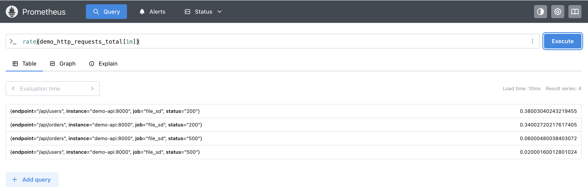

**4. `scalar(sum(demo_http_requests_total))`** — scalaire : une seule valeur numerique sans labels, le total cumule de toutes les series.

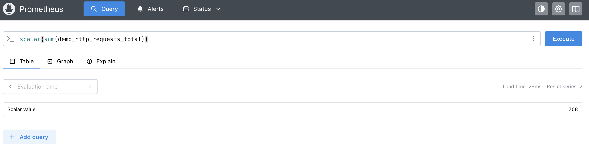

### Exercice 8 : PromQL - agregations et jointures

J'ai mis en pratique trois requetes d'agregation sur demo-api avec ma boucle de trafic active.

**a) Taux de requetes total par endpoint**

```promql
sum by (endpoint) (rate(demo_http_requests_total[5m]))
```

Deux series renvoyees, une par endpoint (`/api/users`, `/api/orders`), chacune en req/s.

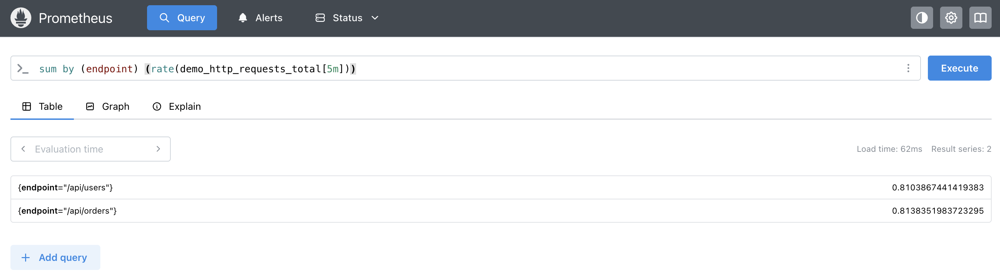

**b) Ratio d'erreurs par endpoint**

```promql
sum by (endpoint) (rate(demo_http_requests_total{status=~"5.."}[5m]))
/
sum by (endpoint) (rate(demo_http_requests_total[5m]))
```

Le ratio se situe autour de 5% pour `/api/users` et 8% pour `/api/orders`, conformement au taux d'erreur configure dans l'app.

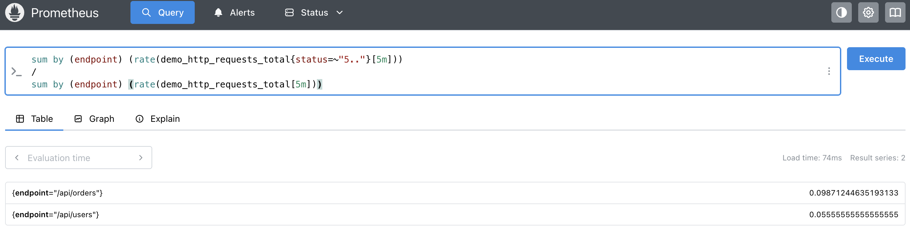

**c) Top 3 des taux par instance**

```promql
topk(3, sum by (instance) (rate(demo_http_requests_total[5m])))
```

`topk()` garde les N series avec les plus grandes valeurs. Comme demo-api ne tourne qu'en une seule instance dans ce lab, une seule serie est renvoyee.

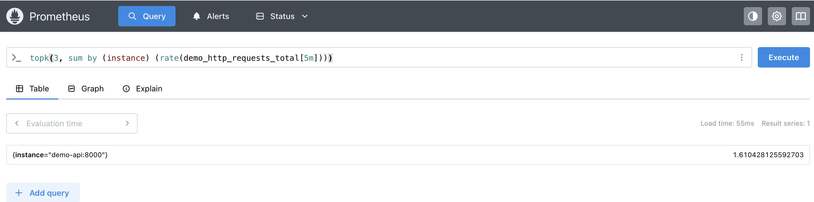

### Exercice 9 : PromQL avance - histogrammes et quantiles

**1. Inspecter les buckets de l'histogramme**

```promql
demo_http_request_duration_seconds_bucket
```

Une serie par bucket (`le="0.01"`, `le="0.025"`, ..., `le="+Inf"`), accompagnee des metriques `_count` et `_sum` qui completent l'histogramme.

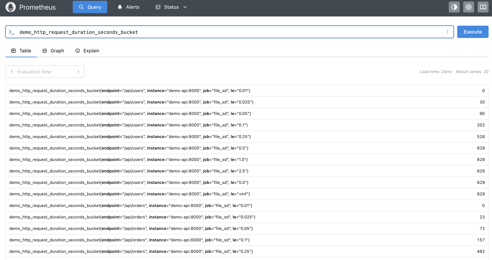

**2. Latence p95 sur /api/orders (sur 5min)**

```promql
histogram_quantile(
  0.95,
  sum by (le, endpoint) (rate(demo_http_request_duration_seconds_bucket{endpoint="/api/orders"}[5m]))
)
```

Le resultat est en secondes : la duree sous laquelle 95% des requetes terminent. Vu que l'app simule un delai aleatoire entre 0.01 et 0.4s, le p95 tourne autour de ~0.38s.

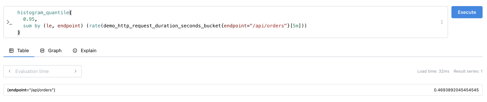

**3. Prediction du nombre de requetes dans 1h**

```promql
predict_linear(demo_http_requests_total[1h], 3600)
```

`predict_linear()` fait une regression lineaire sur la fenetre passee (1h) et extrapole de 3600s dans le futur. Pratique pour des alertes capacite (ex: "le disque sera plein dans 4h").

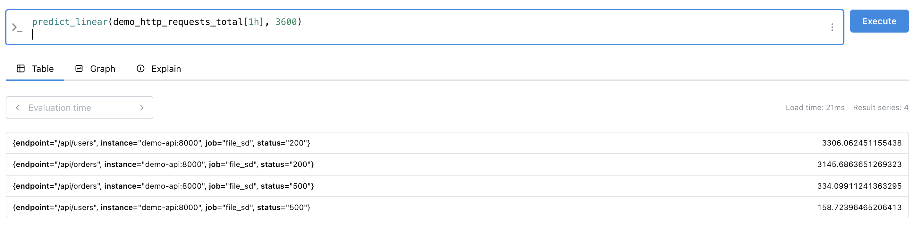

### Exercice 10 : Construire un exporter personnalise et le scraper

Cet exercice a ete fait en amont, des l'exercice 5, lorsque j'ai cree la mini-app Flask `demo-api` ([app/](app/)) qui expose ses propres metriques `demo_*` sur `/metrics`. Le service est buildee directement par le docker-compose (`build: ../app`) et est scrapee via le file_sd configure a l'exercice 4.

Les quatre metriques exposees par l'exporter sont visibles dans les exercices 7, 8 et 9 :
- `demo_http_requests_total` (counter, labels `endpoint` et `status`)
- `demo_http_errors_total` (counter, label `endpoint`)
- `demo_http_requests_in_flight` (gauge)
- `demo_http_request_duration_seconds` (histogram, label `endpoint`)

## Module 2 - Grafana

### Exercice 1 : Installer Grafana et se connecter

J'ai ajoute un service `grafana` au docker-compose (port 3000, volume persistant), puis je me suis connecte sur http://localhost:3000 avec `admin` / `admin` et changé le mot de passe.

### Exercice 2 : Ajouter Prometheus comme source de donnees

Dans Grafana, j'ai ajoute une datasource Prometheus via Connections > Data sources avec l'URL `http://prometheus:9090` (DNS interne du reseau Compose, pas `localhost`). Le `Save & test` confirme la connexion.

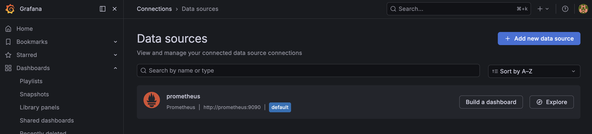

J'ai ensuite teste la requete `up` dans Explore : une ligne par cible UP (prometheus, node-exporter, demo-api).

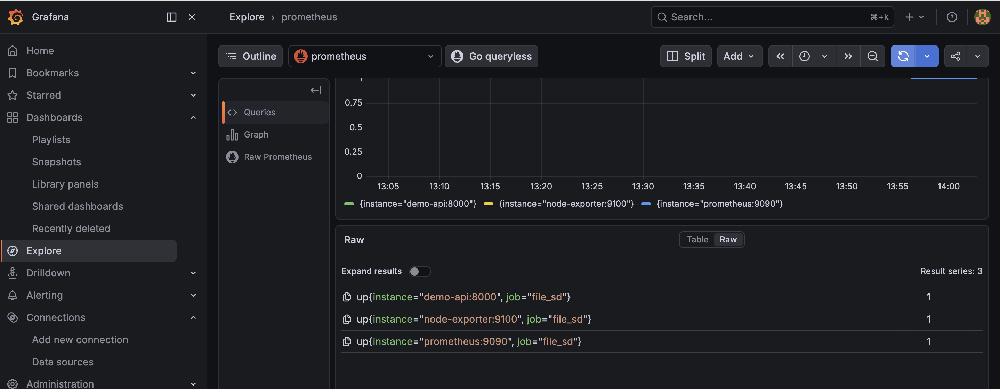

### Exercice 3 : Construire un dashboard pour demo-api

J'ai cree un dashboard `demo-api` avec trois panels :

- **Taux de requetes par endpoint** (Time series) : `sum by (endpoint) (rate(demo_http_requests_total[5m]))`
- **Ratio d'erreurs** (Stat, unite Percent 0.0-1.0, seuils vert/jaune/rouge) : `sum(rate(demo_http_requests_total{status=~"5.."}[5m])) / sum(rate(demo_http_requests_total[5m]))`
- **Latence p95** (Time series, unite seconds) : `histogram_quantile(0.95, sum by (le)(rate(demo_http_request_duration_seconds_bucket[5m])))`

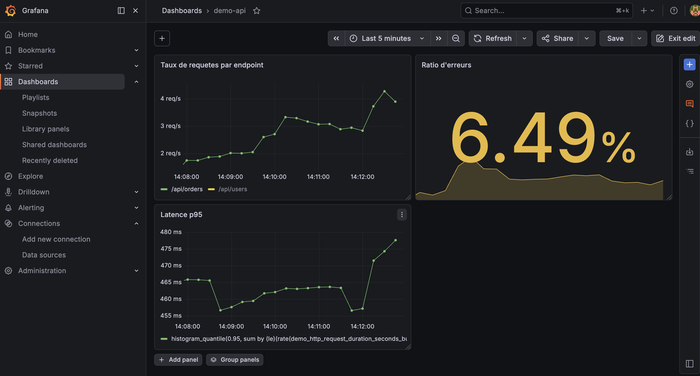

### Exercice 4 : Variables et templating

J'ai ajoute une variable de dashboard `endpoint` (type Query, datasource Prometheus) qui liste les valeurs du label `endpoint` de la metrique `demo_http_requests_total`. Multi-value et "Include All option" actives pour pouvoir filtrer sur un, plusieurs ou tous les endpoints.

J'ai ensuite modifie les 3 panels pour utiliser cette variable avec l'operateur regex (obligatoire en multi-value), par exemple :

```promql
sum by (endpoint) (rate(demo_http_requests_total{endpoint=~"$endpoint"}[5m]))
```

La dropdown apparait en haut du dashboard et filtre dynamiquement les panels selon les endpoints selectionnes.

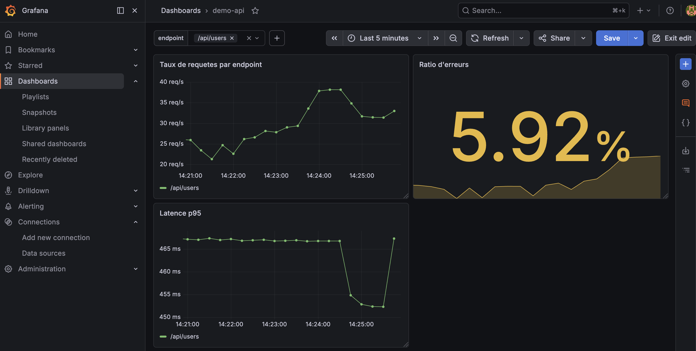

### Exercice 5 : Provisionnement et alertes unifiees

**Provisionnement du dashboard et de la datasource**

J'ai exporte le dashboard `demo-api` en JSON dans `grafana/provisioning/dashboards/demo-api.json`, ajoute un fichier provider `provider.yml` qui pointe Grafana vers ce dossier, et provisionne aussi la datasource Prometheus dans `grafana/provisioning/datasources/prometheus.yml`. Le dossier `grafana/provisioning` est monte dans le conteneur via le docker-compose.

Apres redemarrage de Grafana, le dashboard apparait automatiquement avec le badge "Provisioned" (en lecture seule dans l'UI : il faut editer le JSON pour le modifier).

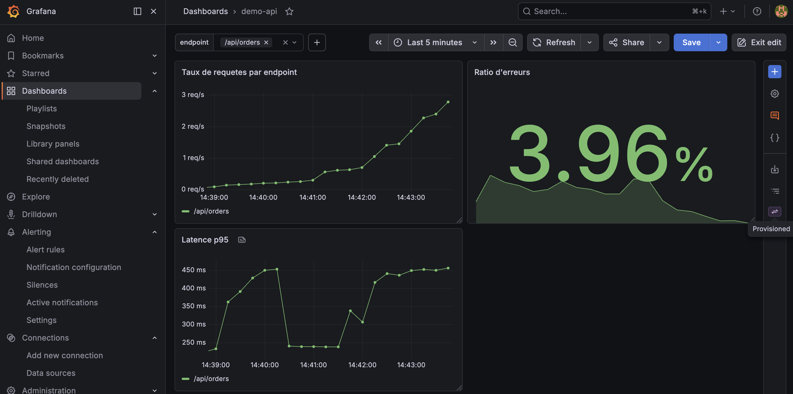

**Alerte Grafana native**

J'ai cree une regle d'alerte `HighErrorRate` dans Alerting > Alert rules avec la meme requete que l'alerte Prometheus de l'exercice 6 (ratio d'erreurs 5xx), seuil `IS ABOVE 0.05`, evaluation toutes les minutes pendant 5 minutes avant declenchement. Groupe d'evaluation : `demo-api-errors`.

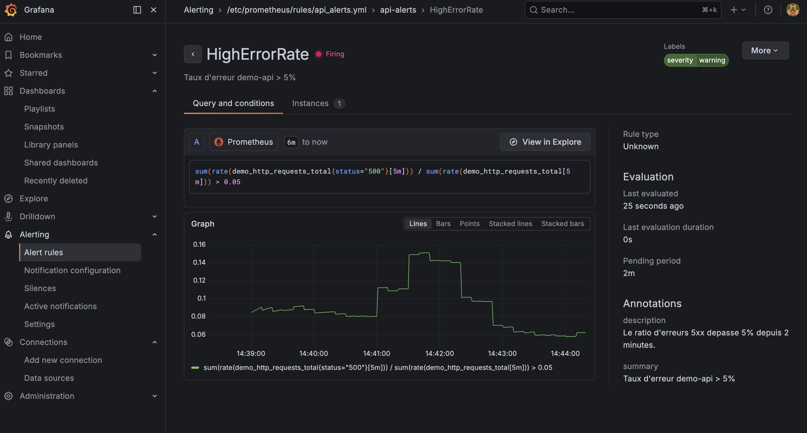